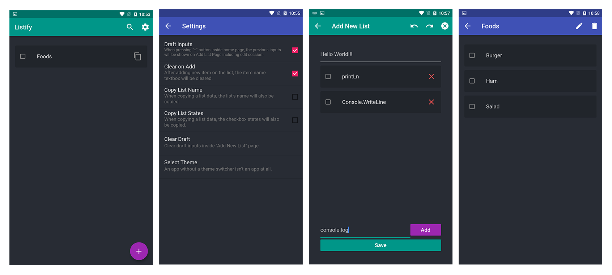

# listify
`flutter-1.17.0`

A flutter todo/task listing example app with advance state management using `Momentum` library. Simple on the outside but powerful in the inside. This app has very simple look and feel really just todo app but the state management with momentum makes it very powerful. This actually turned out as a convenient app because of persistent state + persistent navigation (continue where your left off).

- `Persistent State` - all state is persisted on the device. If you terminate the app and open it again, the states are retained.
- `Persistent Navigation` - navigation between pages is persisted using momentum's powerful built-in router service. If you terminate the app and open it again, the page where you left off will be shown and pressing system back button actually navigates you to the correct previous page means navigation history is also persisted.
- `Equatable` - skip updates if nothing actually changes.
- `Undo/Redo` - undo/redo all inputs.
- `Create Copy` - create a copy of a list.
- `Edit/Delete` - in view mode, you can edit or delete a list.
- `Reorderable lists` - both lists and input items can be reordered. 
- `Search` - simple search feature in home page.
- `App settings` - app options which are easily saved using momentum's persistent feature.
- `Draft inputs` - when back button is pressed the inputs will be saved as draft.

## Docs

I decided to not write comments inside the code because I always find it very distracting. Instead, in this readme I listed most of the things you need to remember to get an idea of how this project works.
<!--TODO: link to official momentum docs-->

### Components
- `CurrentListController` & `CurrentListModel` - this is where the current list state is being stored. This is used in `View List` page.
- `ListController` & `ListModel` - this is where the list data is validated for duplicates during adding of list, search list, `Home` page will display all list created, etc.
- `InputController` & `InputModel` - used in `Add New List` page and `Edit Existing List`. The inputs are handled and validated in this component. Undo/Redo feature is also handled here.
- `SettingsController` & `SettingsModel` - used in `Settings` page and also in some other pages to auto apply settings.
- `ThemeController` & `ThemeModel` - this is where custom manual theming is handled. Because I'm not too familiar with flutter's theme object structure and props name I decided to do it manually. This is used in every page. This is only used in root `MyApp()` to auto apply theme instead of restarting the app.

## Notes
- Some codes are not optimize like widgets that looks almost similar can be merge as one widget and use parameters to make them dynamic like the `ListTile`s for example. I really didn't have time for it :) Feel free to submit a pull request though.
- The theming will rebuild the entire widget tree but it is optimize because of equatable.
- The `ListifyTheme` theme class is not normalized. It has a lot of duplicate properties (same colors) because I thought I'll be able to implement a much more complex theming for this app. I'm leaving it as it is for now.

## Gallery
In this image the process were like this: Open app (home page) -> go to *add list* page -> close and terminate on multitask view -> reopen the app again ... And magic happens! All the inputs were retained and not just that but also including the page where you left off.

#### Dark Mode
Imagine an app without a dark mode. I can't so I added it into the app. Though, because I'm not familiar with the structure of `ThemeData` and its properties and not really a designer type. I kinda did things manually with the help of momentum.

